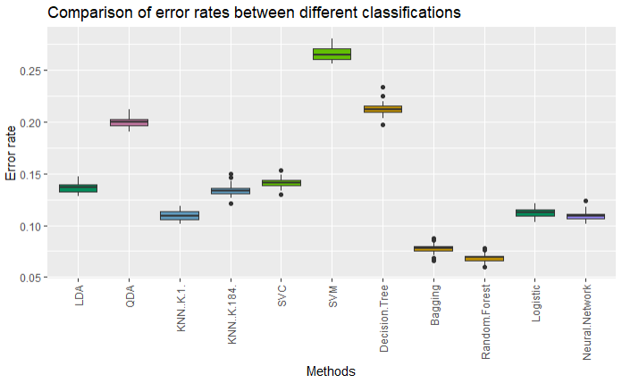

# STOR565: Machine Learning Team Project

## Abstract

This research looks into how to classify fake news using text characteristics. The data set used in this research includes 44,898 observations (23,481fake and 21,417 true). After preprocessing and cleaning the data, we implement two feature extraction methods: bag of n-grams and sentiment analysis. Using the features extracted we build 10 models to classify fake and true news (LDA, QDA, KNN: k = 1, KNN: k = 184, SVC (linear), SVM (polynomial), decision trees, bagging, random forest, logistic, neural networks). From our models, we find that the random forest had the best performance with an accuracy of 0.931, sensitivity of 0.914, and a specificity of 0.947. Looking at the variable importance of the random forest model, we find that news articles including words that are similar to trust are an important indicator of fake news. Also, the average and the 1st quartile of text sentiment scores are important. Based on this finding, we suggest that when individuals are reading news articles, they should be on the lookout for words such as agree, associate, certify, reassure, and verified, since these words are an indication that the article is trustworthy. In addition, individuals should be more alert when reading news articles with a negative voice.  

## Data

Our dataset on real versus fake news comes from [Kaggle](https://www.kaggle.com/datasets/clmentbisaillon/fake-and-real-news-dataset). In GitHub, we have only the most raw data needed to start the project. All data needed or generated for this project can be downloaded from a shared Google drive. 

- Google Drive: [STOR565_Machine_Learning](https://drive.google.com/drive/folders/1jwbjs3ZiSQA7Fs7ka9DW1Rzu1SNe-MX4?usp=sharing)

## Data Pre-processing

We found it necessary to use natural language processing techniques and perform feature extraction since the data that we are using did not come with features that we could work with. 

- Code: `data_cleaning.Rmd` 

## Exploratory Data Analysis(EDA)

To look at the difference between fake and true news, we did exploratory data analysis. In addition, we used a lexicon based method with the Linguistic Inquiry and Word Count(LIWC).

- Code: `Proposal_EDA.Rmd`
- Detailed Description: `Marshmallow_Project_Proposal.pdf`

## Feature extraction

When using text data, the data itself does not include variables with which models can be directly built. Therefore, we need to perform a step of feature extraction. We used two methods:

1. Bag of n-Gram
    + Code: `Feature_extraction_ngram.Rmd`
2. Sentiment Analysis
    + Code: `Feature_extraction_sentiment.Rmd`
    
- Code(combines data): `Feature_extraction_comb.Rmd`

## Modeling

We developed a total of 10 classification methods(LDA, QDA, KNN: k = 1, KNN: k = 184, SVC (linear), SVM (polynomial), decision trees, bagging, random forest, logistic, neural networks).

- Code: `Final_models.Rmd`
- Code(trial and error): `models_knn.Rmd`and `models_svm.Rmd`

## Result

The table below is the summary of the accuracy table for each method.

| Method | Accuracy | Sensitivity | Specificity |
| :----: | :------: | :---------: | :---------: |
| LDA | 0.864 | 0.856 | 0.871 |
| QDA | 0.800 | 0.874 | 0.734 | 
| KNN (K=1)| 0.891 | 0.869 | 0.911 |
| KNN (K=184) | 0.868 | 0.905 | 0.835 |
| SVC | 0.858 | 0.82 | 0.892 |
| SVM | 0.732 | 0.76 | 0.707 |
| Decision Tree | 0.788 | 0.616 | 0.943 |
| Bagging | 0.923 | 0.902 | 0.941 |
| Random Forest | 0.931 | 0.914 | 0.947 |
| Logistic | 0.888 | 0.869 | 0.905 |
| Neural Network | 0.887 | 0.890 | 0.884 |

We also did a test error simulation. Randomly selected 30% of the data from the test set and calculated the test error. We repeated these steps 50 times and implemented a boxplot. 

  
  

  Boxplot of Classification Model Error rate

## About

- Team member: Kyungjin Sohn, SooHyun Kim, Winnie Ren, Yang Xiao, Ziang Li
- Last updated: 04.29.2022
